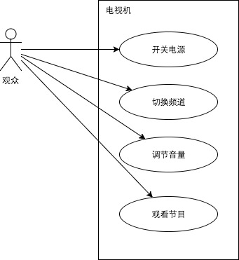
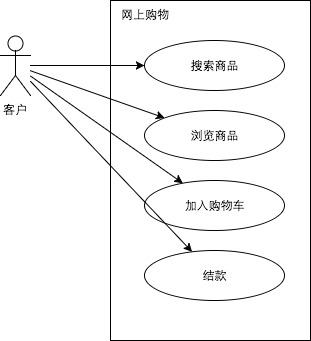

# UML

* Actor 参与者 在系统中存在利害关系的一个角色，可以是人，系统或者是装置设备。
* Usecase 用例
* Association 参与者与用例之间关联
* Generalization 参与者与参与者或者用例与用例之间继承关系
* Dependency  用例与用例之间关联 

## 如何描述系统功能

何为系统？提供特定功能或者服务的环境、场景或者机器设备。

譬如：电视机，我们可以通过它收看新闻，电影，电视剧。
 

作为观众

* 想看电视，我可以打开电视机的电源。
* 想看喜欢的节目，可以切换频道。
* 如果音量不满意，可以进行调节。
* 如果节目喜欢，可以停在选择的频道，慢慢收看。
* 如果不想看了，我可以关掉电视机的电源。

譬如： 银行，我们可以去银行取钱，存款，理财，贷款

譬如: 网上购物，想要买自己想要的商品，首先可以搜索一下，通过浏览商品比对好坏，确定想购买的商品可以加入购物车，最后结款等待货物上门。

